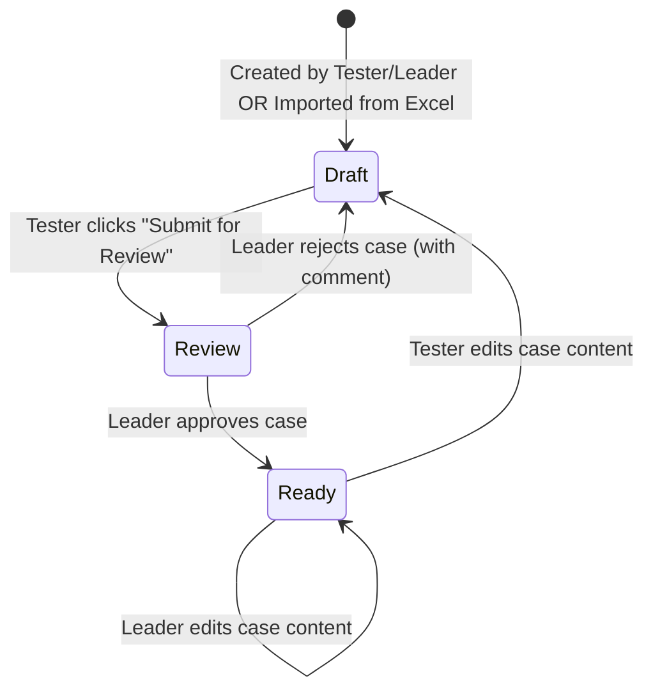
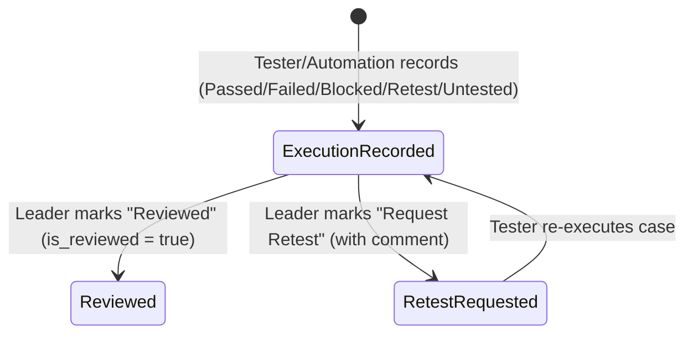
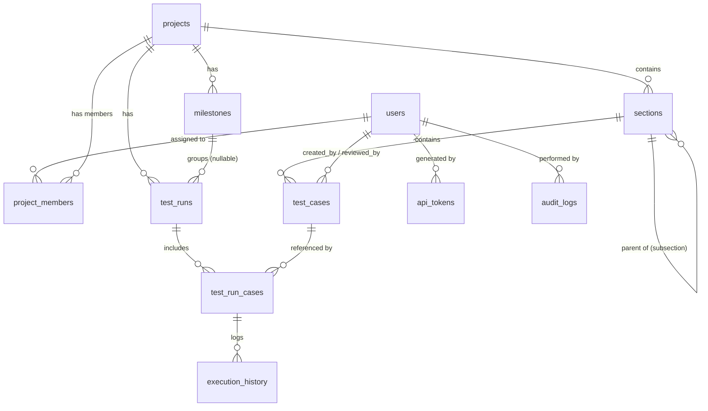

# AI_CONTEXT.md — Domain & Technical Context Reference

> [!NOTE]
> This document serves as a rapid domain lookup and technical reference for AI agents working on the TestFlow Lite codebase. It is directly synchronized with [DacTa-TestFlowLite-SRS.md](./DacTa-TestFlowLite-SRS.md) v3.0.
>
> For the live, up-to-date feature implementation matrix and current work status, see [CURRENT_STATE.md](./CURRENT_STATE.md).

---

## 1. Domain Glossary

- **Section / Subsection**: Hierarchical tree nodes used to organize Test Cases within a Project. A Section can contain child Subsections with unlimited depth (`parent_section_id`).
- **Test Case**: The atomic test specification unit, following a 3-state lifecycle (`Draft` → `Review` → `Ready`).
- **Test Run**: An execution instance of selected Test Cases attached directly to a Project, optionally linked to a **Milestone**.
- **Milestone**: A lightweight tracking label (Name + Due Date) attached to a Project to group and monitor Test Run completion progress.

---

## 2. State Machines

### 2.1 Test Case Lifecycle

### 2.2 Test Result Review Lifecycle

---

## 3. Data Model & Entity Relationship Diagram

### 3.1 Entity Relationship Diagram (Mermaid)

### 3.2 Database Table Schema Summary

1. `users`: `id`, `username`, `email`, `password_hash`, `full_name`, `role` (`LEADER`/`TESTER`), `is_active`, `created_at`
2. `projects`: `id`, `name`, `description`, `status` (`Active`/`Archived`), `created_by`, `created_at`
3. `project_members`: `id`, `project_id`, `user_id`
4. `sections`: `id`, `project_id`, `parent_section_id` (self-reference), `name`, `sort_order`
5. `test_cases`: `id`, `code` (e.g. `TC-0001`), `section_id`, `title`, `precondition`, `steps`, `expected_result`, `test_data`, `priority`, `type`, `automation_status`, `status` (`Draft`/`Review`/`Ready`), `review_comment`, `created_by`, `reviewed_by`, `reviewed_at`, `created_at`, `updated_at`
6. `milestones`: `id`, `project_id`, `name`, `due_date`, `status` (`Open`/`Closed`), `created_by`, `created_at`
7. `test_runs`: `id`, `project_id`, `milestone_id` (nullable), `name`, `status` (`Open`/`Closed`), `created_by`, `created_at`, `closed_at`
8. `test_run_cases`: `id`, `run_id`, `case_id`, `assigned_to`, `result_status` (`Passed`/`Failed`/`Blocked`/`Retest`/`Untested`), `executed_by`, `executed_at`, `comment`, `defect_ref`, `is_reviewed`, `reviewed_by`, `reviewed_at`, `review_comment`
9. `execution_history`: `id`, `run_case_id`, `result_status`, `comment`, `executed_by`, `executed_at`
10. `attachments`: `id`, `entity_type`, `entity_id`, `file_path`, `uploaded_by`, `uploaded_at`
11. `api_tokens`: `id`, `created_by`, `token`, `created_at`, `last_used_at`
12. `audit_logs`: `id`, `user_id`, `action`, `entity_type`, `entity_id`, `detail_json`, `created_at`

---

## 4. Enumeration Definitions

- **Role**: `LEADER`, `TESTER`
- **Priority**: `Low`, `Medium`, `High`, `Critical`
- **TestType**: `Functional`, `Regression`, `Smoke`, `Performance`, `Security`, `Usability`, `Other`
- **AutomationStatus**: `Manual`, `Automated`, `To Automate` (Default: `Manual`)
- **CaseStatus**: `Draft`, `Review`, `Ready`
- **ResultStatus**: `Passed`, `Failed`, `Blocked`, `Retest`, `Untested` (Default: `Untested`)
- **ProjectStatus**: `Active`, `Archived`
- **MilestoneStatus**: `Open`, `Closed`
- **RunStatus**: `Open`, `Closed`

---

## 5. API Endpoints Catalog

> For detailed implementation status per module, see [CURRENT_STATE.md](./CURRENT_STATE.md).

| Method | Endpoint | Description | Role Required | Status |
|---|---|---|---|:---:|
| POST | `/api/auth/login` | User login (JWT Access + Refresh token) | Public | ✅ Implemented (Slice 1) |
| POST | `/api/auth/refresh` | Refresh access token | Public | ✅ Implemented (Slice 1) |
| GET | `/api/users/me` | Fetch current authenticated user info | Authenticated | ✅ Implemented (Slice 1) |
| PUT | `/api/users/me/password` | Change current user password | Authenticated | ✅ Implemented (Slice 1) |
| GET/POST | `/api/users` | List / Create Tester accounts | Leader | ✅ Implemented (Slice 1) |
| PUT | `/api/users/{id}` | Update Tester details / Active status | Leader | ✅ Implemented (Slice 1) |
| GET/POST/PUT | `/api/projects` | CRUD projects | Leader (Read: Tester assigned) | ✅ Implemented (Slice 2) |
| POST/DELETE | `/api/projects/{id}/members` | Assign / Remove Testers for Project | Leader | ✅ Implemented (Slice 2) |
| GET/POST/PUT/DELETE | `/api/projects/{id}/sections` | Section/Subsection management | Leader / Tester (No delete for Tester) | Stub |
| GET/POST/PUT/DELETE | `/api/cases` | Test Case CRUD | Leader / Tester | Stub |
| POST | `/api/cases/{id}/submit-review` | Submit Test Case for review | Tester | Stub |
| POST | `/api/cases/{id}/approve` | Approve Test Case (`Review` → `Ready`) | Leader | Stub |
| POST | `/api/cases/{id}/reject` | Reject Test Case (`Review` → `Draft`) | Leader | Stub |
| GET | `/api/cases/review-queue` | List cases pending review | Leader | Stub |
| POST | `/api/cases/import/validate` | Validate Excel template & return line errors | Leader / Tester | Stub |
| POST | `/api/cases/import/confirm` | Confirm Excel import to DB (`Draft` state) | Leader / Tester | Stub |
| GET | `/api/cases/export` | Export Test Cases to Excel | Leader / Tester | Stub |
| GET/POST/PUT | `/api/milestones` | Manage Milestones | Leader | Stub |
| GET/POST/PUT | `/api/runs` | Create & Manage Test Runs | Leader | Stub |
| POST | `/api/runs/{id}/cases/{caseId}/execute` | Record manual test execution result | Leader / Tester | Stub |
| POST | `/api/runs/{id}/cases/{caseId}/review` | Review execution result | Leader | Stub |
| POST | `/api/automation/results` | Submit automated test execution result | API Token (`X-API-TOKEN`) | Stub |
| GET | `/api/runs/{id}/report` | Generate Run report / Export Run to Excel | Leader / Tester | Stub |
| GET | `/api/dashboard/{projectId}` | Fetch aggregated dashboard metrics | Leader / Tester | Stub |

---

## 6. Excel Import / Export Specifications

### 6.1 Import Template Columns (`TestCases` Sheet)

| Column | Mandatory | Type | Notes |
|---|:---:|---|---|
| Section Path | ✅ | Text | Hierarchical path with `/` (e.g. `Login/Negative`). Auto-creates sections |
| Title | ✅ | Text | Test Case Title |
| Pre-condition | ✅ | Text | Pre-requisite steps |
| Steps | ✅ | Text | Multi-line execution steps |
| Expected Result | ✅ | Text | Expected behavior |
| Test Data | ❌ | Text | Input test data / accounts |
| Priority | ✅ | Enum | `Low` / `Medium` / `High` / `Critical` |
| Type | ✅ | Enum | `Functional` / `Regression` / `Smoke` / `Performance` / `Security` / `Usability` / `Other` |
| Automation Status | ❌ | Enum | `Manual` / `Automated` / `To Automate` (Default: `Manual`) |

*Rule:* All imported cases enter in `Draft` status regardless of importer's role.

---

## 7. Development Roadmap

| Phase | Core Objectives | Status |
|---|---|:---:|
| **Phase 1 — MVP** | Core Auth, Projects, Sections, Test Case Workflow (`Draft`/`Review`/`Ready`), 2-step Excel Import/Export, Milestones, Test Runs & Execution, Result Review, Automation API, Dashboard | 🟢 Current Scope |
| **Phase 2** | Multi-language (i18n Vietnamese), Cloud Production deployment architecture, WebSockets/SSE real-time, In-app/Email Notifications, PDF Reports | ⏳ Deferred |
| **Phase 3** | CI/CD Webhooks integration, 3rd party Bug Tracker sync (Jira/GitHub Issues) | ⏳ Optional |

---

*This file is derived from [DacTa-TestFlowLite-SRS.md](./DacTa-TestFlowLite-SRS.md) v3.0. When SRS is updated, this file MUST be synchronized.*
