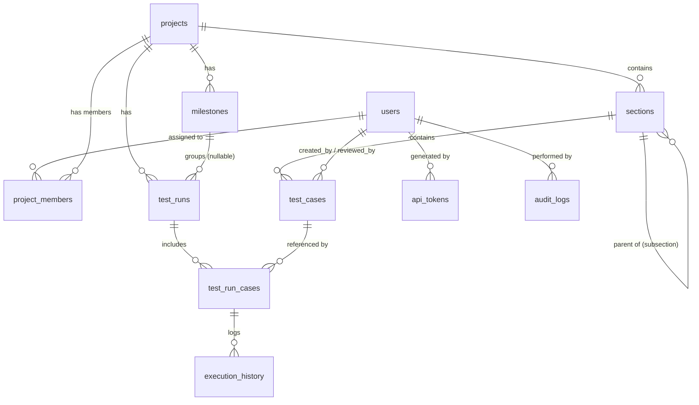

# Data Model Specification — TestFlow Lite

## 1. Entity Relationship Diagram (ERD)

---

## 2. Table Specifications

### 2.1 `users`
Stores user accounts. Only 1 `LEADER` account exists (seeded), with up to 9 `TESTER` accounts.
- `id` (BIGINT, PK, AUTO_INCREMENT)
- `username` (VARCHAR(50), UNIQUE, NOT NULL)
- `email` (VARCHAR(100), UNIQUE, NOT NULL)
- `password_hash` (VARCHAR(255), NOT NULL)
- `full_name` (VARCHAR(100), NOT NULL)
- `role` (ENUM('LEADER', 'TESTER'), NOT NULL)
- `is_active` (BOOLEAN, DEFAULT true)
- `created_at` (DATETIME, NOT NULL)

### 2.2 `projects`
Stores software testing projects.
- `id` (BIGINT, PK, AUTO_INCREMENT)
- `name` (VARCHAR(100), NOT NULL)
- `description` (TEXT)
- `status` (ENUM('Active', 'Archived'), DEFAULT 'Active')
- `created_by` (BIGINT, FK -> users.id)
- `created_at` (DATETIME, NOT NULL)

### 2.3 `project_members`
Junction table assigning Testers to Projects.
- `id` (BIGINT, PK, AUTO_INCREMENT)
- `project_id` (BIGINT, FK -> projects.id)
- `user_id` (BIGINT, FK -> users.id)

### 2.4 `sections`
Hierarchical structure for organizing Test Cases (Supports infinite Subsection nesting via self-reference).
- `id` (BIGINT, PK, AUTO_INCREMENT)
- `project_id` (BIGINT, FK -> projects.id)
- `parent_section_id` (BIGINT, FK -> sections.id, NULLABLE)
- `name` (VARCHAR(100), NOT NULL)
- `sort_order` (INT, DEFAULT 0)

### 2.5 `test_cases`
Main Test Case definitions.
- `id` (BIGINT, PK, AUTO_INCREMENT)
- `code` (VARCHAR(20), NOT NULL, UNIQUE)
- `section_id` (BIGINT, FK -> sections.id)
- `title` (VARCHAR(255), NOT NULL)
- `precondition` (TEXT)
- `steps` (TEXT, NOT NULL)
- `expected_result` (TEXT, NOT NULL)
- `test_data` (TEXT)
- `priority` (ENUM('Low', 'Medium', 'High', 'Critical'), DEFAULT 'Medium')
- `type` (ENUM('Functional', 'Regression', 'Smoke', 'Performance', 'Security', 'Usability', 'Other'))
- `automation_status` (ENUM('Manual', 'Automated', 'To Automate'), DEFAULT 'Manual')
- `status` (ENUM('Draft', 'Review', 'Ready'), DEFAULT 'Draft')
- `review_comment` (TEXT)
- `created_by` (BIGINT, FK -> users.id)
- `reviewed_by` (BIGINT, FK -> users.id, NULLABLE)
- `reviewed_at` (DATETIME, NULLABLE)
- `created_at` (DATETIME, NOT NULL)
- `updated_at` (DATETIME, NOT NULL)

### 2.6 `milestones`
Project progress tracking labels with due dates.
- `id` (BIGINT, PK, AUTO_INCREMENT)
- `project_id` (BIGINT, FK -> projects.id)
- `name` (VARCHAR(100), NOT NULL)
- `due_date` (DATE)
- `status` (ENUM('Open', 'Closed'), DEFAULT 'Open')
- `created_by` (BIGINT, FK -> users.id)
- `created_at` (DATETIME, NOT NULL)

### 2.7 `test_runs`
Execution run instances.
- `id` (BIGINT, PK, AUTO_INCREMENT)
- `project_id` (BIGINT, FK -> projects.id)
- `milestone_id` (BIGINT, FK -> milestones.id, NULLABLE)
- `name` (VARCHAR(100), NOT NULL)
- `status` (ENUM('Open', 'Closed'), DEFAULT 'Open')
- `created_by` (BIGINT, FK -> users.id)
- `created_at` (DATETIME, NOT NULL)
- `closed_at` (DATETIME, NULLABLE)

### 2.8 `test_run_cases`
Individual case assignments within a Test Run.
- `id` (BIGINT, PK, AUTO_INCREMENT)
- `run_id` (BIGINT, FK -> test_runs.id)
- `case_id` (BIGINT, FK -> test_cases.id)
- `assigned_to` (BIGINT, FK -> users.id, NULLABLE)
- `result_status` (ENUM('Passed', 'Failed', 'Blocked', 'Retest', 'Untested'), DEFAULT 'Untested')
- `executed_by` (VARCHAR(100))
- `executed_at` (DATETIME)
- `comment` (TEXT)
- `defect_ref` (VARCHAR(255))
- `is_reviewed` (BOOLEAN, DEFAULT false)
- `reviewed_by` (BIGINT, FK -> users.id, NULLABLE)
- `reviewed_at` (DATETIME, NULLABLE)
- `review_comment` (TEXT)

### 2.9 `execution_history`
History log of test execution state changes.
- `id` (BIGINT, PK, AUTO_INCREMENT)
- `run_case_id` (BIGINT, FK -> test_run_cases.id)
- `result_status` (ENUM('Passed', 'Failed', 'Blocked', 'Retest', 'Untested'))
- `comment` (TEXT)
- `executed_by` (VARCHAR(100))
- `executed_at` (DATETIME)

### 2.10 `attachments`
Attached screenshots/files.
- `id` (BIGINT, PK, AUTO_INCREMENT)
- `entity_type` (VARCHAR(50))
- `entity_id` (BIGINT)
- `file_path` (VARCHAR(255))
- `uploaded_by` (BIGINT, FK -> users.id)
- `uploaded_at` (DATETIME)

### 2.11 `api_tokens`
API Tokens for Automation result submission endpoint.
- `id` (BIGINT, PK, AUTO_INCREMENT)
- `created_by` (BIGINT, FK -> users.id)
- `token` (VARCHAR(100), UNIQUE, NOT NULL)
- `created_at` (DATETIME, NOT NULL)
- `last_used_at` (DATETIME)

### 2.12 `audit_logs`
System audit tracking for sensitive state transitions.
- `id` (BIGINT, PK, AUTO_INCREMENT)
- `user_id` (BIGINT, FK -> users.id)
- `action` (VARCHAR(100), NOT NULL)
- `entity_type` (VARCHAR(50))
- `entity_id` (BIGINT)
- `detail_json` (TEXT)
- `created_at` (DATETIME, NOT NULL)
